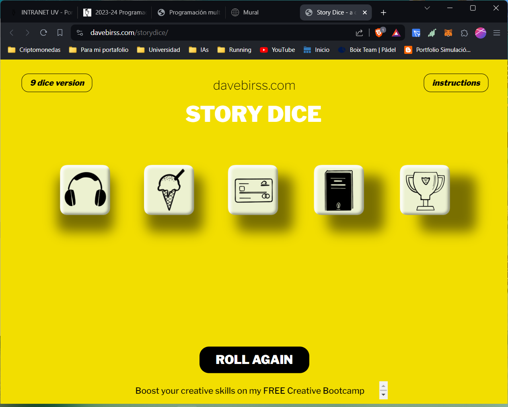
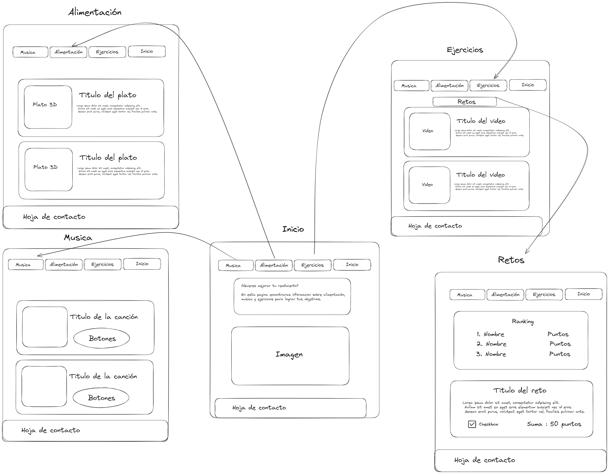

# FitVibes: Música, Nutrición y Desafíos 🔱

## Prototipo de la página 🏫

Para la página nos hemos basado en el siguiente "**Story Cubes**":

<p align="center">
    
</p>
Hemos realizado el siguiente esquema para la página:
<p align="center">

</p>

## Estructura del repositorio 🚀

La estructura del repositorio se divide de la siguiente manera:

```
/
├── index.html/
├── src/
│   └── css
│   └── fonts
│   └── html
│   └── images
│   └── js
/
```

## Autores ✒️

- **Mario Gil Domingo** - [Mariogil2001](https://github.com/Mariogil2001)
- **Enrique Morcillo Martínez** - [kitex03](https://github.com/kitex03)
